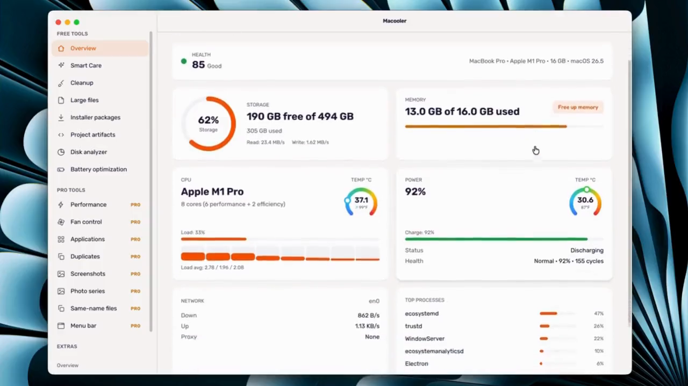
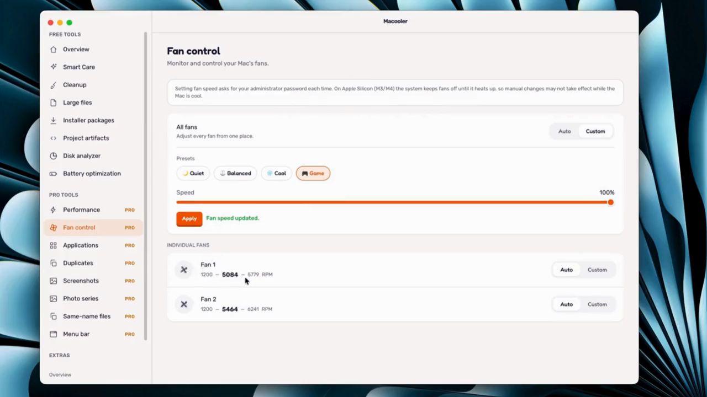
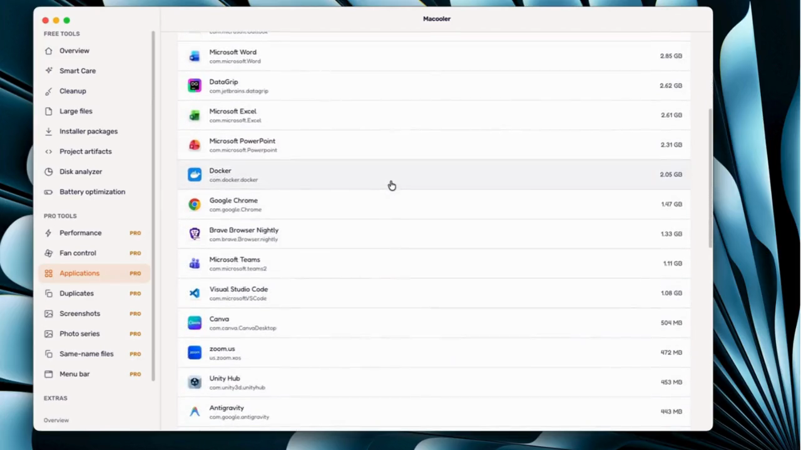
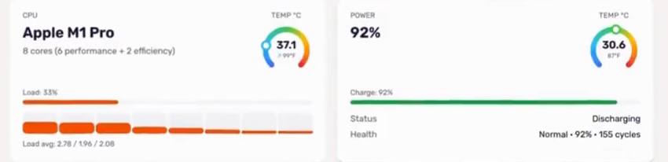
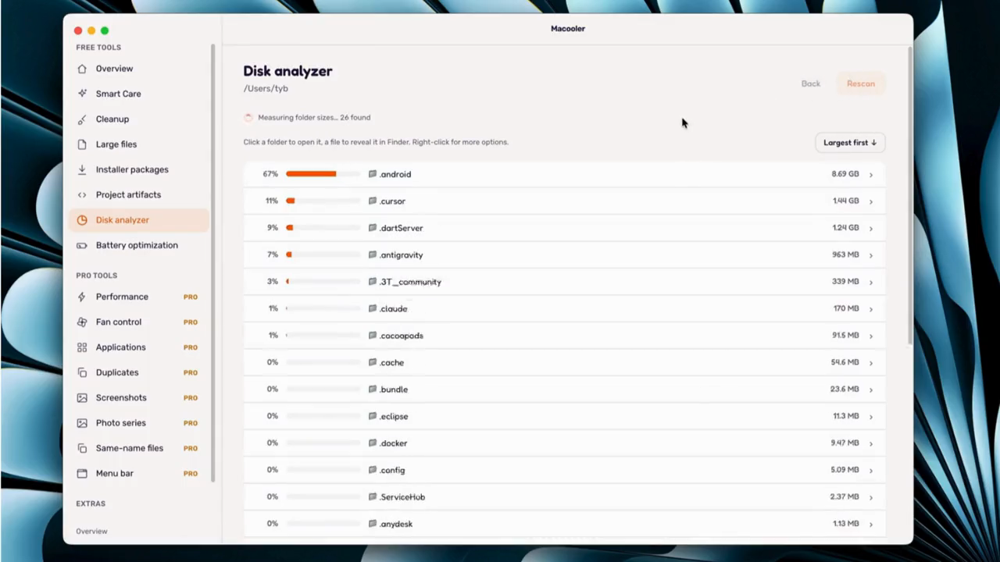
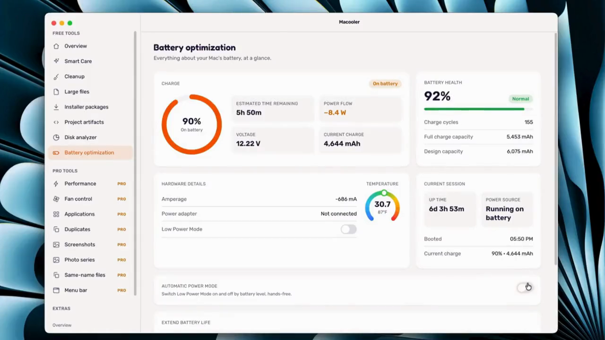
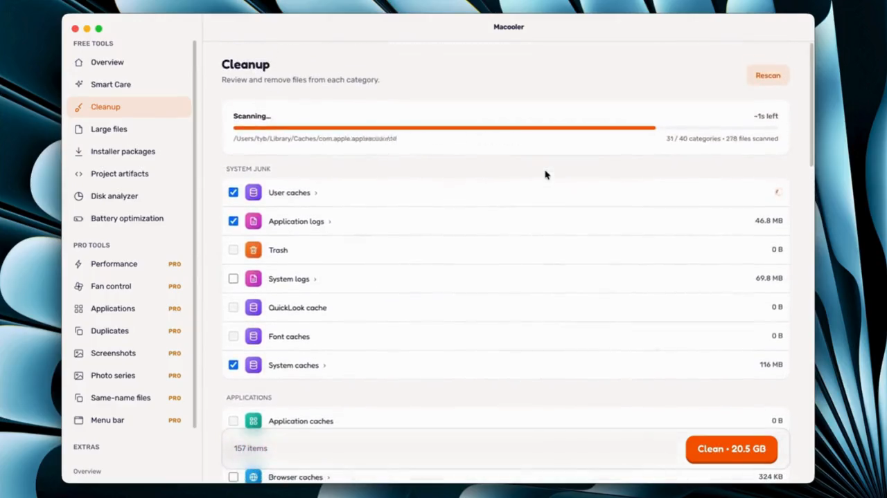

<h1>Macooler</h1>

<strong>Take control. <em>Run cooler.</em></strong>

Live CPU &amp; GPU temperature, real fan control and system insight — 
native for Apple Silicon and Intel.

  
  
  
  
  

  <a href="https://macooler.com/"><strong>Website</strong></a> ·
  <a href="https://macooler.com/#download"><strong>Download</strong></a> ·
  <a href="#pricing"><strong>Pricing</strong></a> ·
  <a href="https://macooler.com/guides/"><strong>Guides</strong></a> ·
  <a href="#faq"><strong>FAQ</strong></a>

---

|          **−12°C**          |             **&lt;1%**             |        **M1 → M4**        |
| :-------------------------: | :--------------------------------: | :-----------------------: |
| average peak temperature | CPU used while monitoring | and Intel Macs |

Macooler reads your Mac's sensors and shows live CPU, GPU and battery
temperature, gives you real fan control, and points out what is driving the
heat — so you can cool it down in seconds.

---

## One app. Every tool.

**Everything your Mac needs, _beautifully native._**

Monitoring, temperature, fans, power and disk — a focused set of tools that feel
like they shipped with macOS.

 

### 🌀 &nbsp;Spin them up, _cool it down._

> **Fan control**

Take manual control of every fan by RPM with **Quiet**, **Balanced**, **Cool**
and **Game** presets — real fan control on Apple Silicon (M1–M4) and Intel, so
your Mac never throttles under heavy load.

 

### 🧮 &nbsp;See what's _eating your Mac._

> **Process insight**

Watch what's using your CPU and memory in real time, spot the runaway app in
seconds, and stop it in a single click — before it drains your battery and heats
things up.

 

### 🌡️ &nbsp;Every sensor, _live._

> **Temperature**

Watch CPU, GPU and battery temperature update in real time, with a heads-up
before your Mac starts to run hot — right in the app and in the menu bar.

 

### 🗺️ &nbsp;Find what's _filling your disk._

> **Disk insight**

A visual folder-size explorer that shows real on-disk usage — accurate even on
APFS clones and sparse files — so you can find the biggest files and free up
space fast.

 

### 🔋 &nbsp;Make your battery _last longer._

> **Battery health**

Track charge, health, cycles and temperature, and let hands-free Low Power Mode
automation kick in by battery level — so your battery stays healthier for longer.

---

## Smart Care

Apps quietly pile up caches, logs and build leftovers. Macooler shows what each
one is holding and clears **only what you tick** — nothing goes without your
say-so.

### What it clears

| | Category | Where it lives |
| :-: | :-- | :-- |
| ✅ | Caches | `~/Library/Caches` |
| ✅ | Logs | `~/Library/Logs` |
| ✅ | Derived data | `~/Library/Developer/Xcode` |
| ✅ | App leftovers | `~/Library/Application Support` |
| ☐ | Downloads | `~/Downloads` |
| ☐ | Trash | `~/.Trash` |

✅ = on by default. Downloads and Trash are left for you to decide.

### Knows where apps hide it

Every app caches somewhere different. Macooler knows the paths for the ones that
grow fastest — from Xcode's `DerivedData` to browser, design and chat app caches.

  
  
  
  
  
  
  
  
  
  

---

## Every feature

| | Feature | Tier | What it does |
| :-: | :-- | :-- | :-- |
| 🩺 | **Health Dashboard** | Free | A one-glance health score with live CPU, memory, temperature, power, network and top-process widgets. |
| ⚡ | **Live Performance** | Free | Real-time Memory, CPU and swap meters, plus login-item and heavy-app management to keep your Mac responsive. |
| 🌡️ | **Temperature** | Free | Watch CPU, GPU and battery temperature in real time, with alerts before your Mac starts to run hot. |
| 🧮 | **Process Insight** | Free | See what's using your CPU and memory in real time, and stop a runaway process in one click. |
| 🌐 | **Network Monitor** | Free | Live upload and download throughput so you always know what your Mac is sending and receiving. |
| 🗺️ | **Disk Insight** | Free | A visual folder-size explorer that shows real on-disk usage — accurate even on APFS clones and sparse files. |
| 🔋 | **Battery Health** | Free | Charge, health, cycles, temperature and hands-free Low Power Mode automation that toggles by battery level. |
| ✨ | **Smart Care** | Free | One-click system maintenance: free inactive memory, flush DNS, rebuild Spotlight &amp; Launch Services, restart Finder and Dock. |
| 🌀 | **Fan Control** | **Pro** | Read and set every fan by RPM with Quiet, Balanced, Cool and Game presets — real fan control on Apple Silicon (M1–M4) and Intel, powered by a native driver. |
| 📊 | **Menu-Bar Monitor** | **Pro** | A live menu-bar readout of CPU temperature, load, fan speed, memory, disk, network and battery — always in view. |

### What it watches, in real time

`CPU & GPU load` &nbsp;·&nbsp; `Temperature & fan speed` &nbsp;·&nbsp; `Memory pressure` &nbsp;·&nbsp; `Battery health & cycles` &nbsp;·&nbsp; `Disk usage` &nbsp;·&nbsp; `Network throughput`

---

## For everyone who pushes their Mac

| | |
| :-- | :-- |
| **Developers** | Xcode, Docker, simulators and bundlers run hot. Watch the CPU, memory and heat behind every build and keep the fans ahead of it. |
| **Creators** | Editing, rendering and exporting push your Mac hard. See temperature live and spin the fans up so exports never thermal-throttle. |
| **Gamers** | A Game fan preset for maximum cooling, live temps and battery insight — squeeze every frame without cooking your machine. |
| **Everyday** | One live health score, Smart Care one-click maintenance and battery care — keep a quiet Mac quiet and a healthy Mac healthy. |

Kept an eye on: Xcode builds · iOS Simulator · Docker · node &amp; pnpm · Homebrew · Gradle &amp; Maven · Cargo &amp; Go · CocoaPods · Python venvs · Frontend bundlers

---

**Macooler** &nbsp;·&nbsp; macOS app

Made for macOS · Apple Silicon &amp; Intel

<a href="https://macooler.com/privacy.html">Privacy policy</a> ·
<a href="https://macooler.com/terms.html">Terms of service</a> ·
<a href="https://macooler.com/refunds.html">Refund policy</a> ·
<a href="mailto:info@macooler.com">Support</a>

© 2025 Macooler.com — All rights reserved

